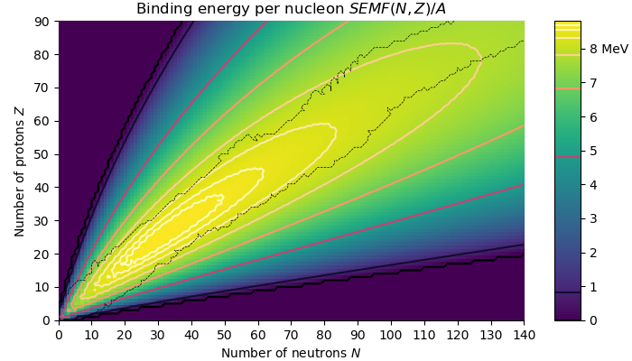
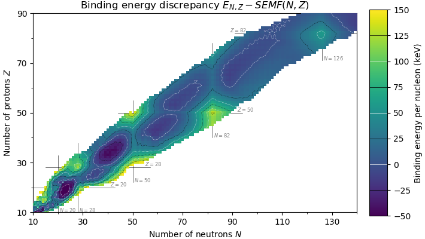
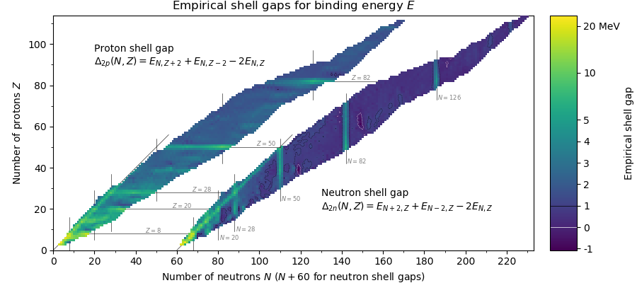

# Semi-empirical mass formula for binding energy and its discrepancies

Graphs on the Semi-Empirical Mass Formula (SEMF), an approximation for binding energy, as configured with least-squares fit<sup>1</sup>, and as contrasted to experimentally-obtained mass discrepancies<sup>2</sup>.

These graphs are used in some undergraduate papers; I have uncluded them in relevant Wikipedia articles (click the images for their Wikimedia Commons pages). As such, they are in the public domain under the Creative Commons CC0 license.

I'm currently managing these graphs, so please send a pull request to maintain consistency with the Wikipedia versions.

## Liquid drop model
<a href="https://commons.wikimedia.org/wiki/File:Semi-empirical_mass_formula.png">
  
</a>

The mean binding energy of the semi-empirical mass formula. Observe that below 8 MeV nuclei rapidly become unstable outside the region of nuclei that have been discovered (as indicated by a dashed line). Contours double in energy difference as moving away from the maximum predicted binding energy. 

## Liquid drop model discrepancies
<a href="https://commons.wikimedia.org/wiki/File:Semi-empirical_mass_formula_discrepancy.png">
  
</a>

The discrepancy between experimentally-obtained binding energies and those predicted by the SEMF. Energy colours are trimmed to the range *-50 < E < 150* for contrast.

## Nuclear shell gaps

<a href="https://commons.wikimedia.org/wiki/File:Empirical_Shell_Gap.png">
  
</a>

The empirical shell gaps, the second difference over nuclide number. The difference over two particles is taken to avoid the noise from the spin coupling effect. Note the contour "snap" in the discrepancy is far more visible here.

The intermediate two-particle separation energy is used:
```
S2p(N,Z) = E(N,Z-2) - E(N,Z) + 2m_p
S2p(N,Z) = E(N-2,Z) - E(N,Z) + 2m_p
```
This produces the empirical shell gaps:
```
Δ2p(N, Z) = S2p(N,Z) - S2p(N,Z+2)
Δ2p(N, Z) = S2p(N,Z) - S2p(N+2,Z)
```
In other words, the empirical shell gap is expressed entirely using the binding energies *E*:
```
Δ2p(N,Z) = E(N,Z-2) + E(N,Z+2) - 2 E(N,Z)
Δ2n(N,Z) = E(N-2,Z) + E(N+2,Z) - 2 E(N,Z)
```

## References

1. Rohlf, J.W. Modern Physics from &alpha; to Z<sup>0</sup>. Wiley (1994).
2. Wang, M., et al. The AME2016 mass evaluation.
