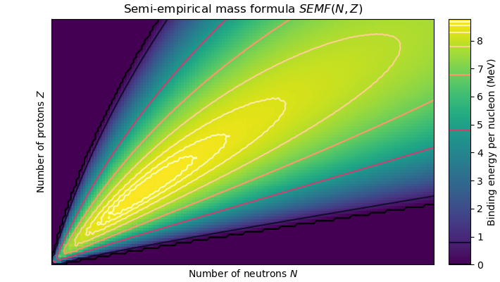
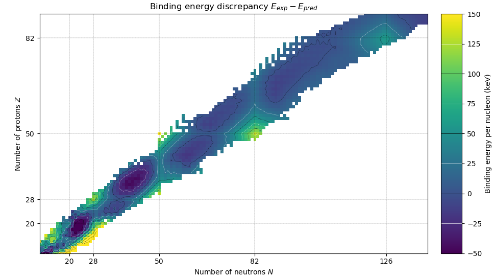

# Semi-empirical mass formula for binding energy and its discrepancies

Two graphs on the Semi-Empirical Mass Formula (SEMF), an approximation for binding energy, as configured with least-squares fit1, and as contrasted to experimentally-obtained mass discrepancies2.

These graphs are used in a small undergraduate summary paper by myself labelled "Nuclear organisation", which explains the theory behind these graphs in better detail; the text will be transcluded here when it is completed. 

## Prediction

The mean binding energy of the semi-empirical mass formula. Observe that below 8 MeV nuclei rapidly become unstable outside the region of nuclei that have been discovered (as indicated by a dashed line). Contours double in energy difference as moving away from the maximum predicted binding energy. 

## Discrepancy

The discrepancy between experimentally-obtained binding energies and those predicted by the SEMF. Energy colours are trimmed to the range *-50 < E < 150* for contrast.

## Methodology

The atomic mass evaluation is explicitly used, as the doubly magic *N=50, Z=50* nucleus is not included in 2012 or 2016 data. Attempts were made to include older (but for some reason or another, dropped) nuclei in a newer data set, but this was abandoned due to time constraints.

## References

1. Rohlf, J.W. Modern Physics from &alpha; to Z0. Wiley (1994).
2. Audi G., Wapstra A.H., Thibault C. The Ame2003 atomic mass evaluation (II). [`mass.mas03`](http://www.oecd-nea.org/dbdata/data/mass-evals2003/mass.mas03).
