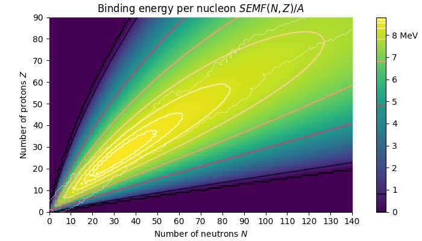
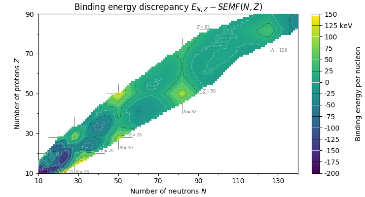
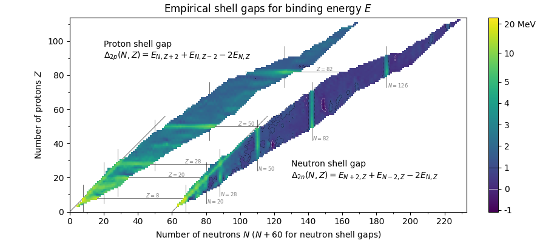

# nuclear-graphs

Graphs of the Atomic Mass Evaluation and Nubase Evaluation, found at the [AMDC](https://www-nds.iaea.org/amdc/). Currently only the 2016 dataset is in use.

Currently limited to graphs of the liquid drop model (Semi-Empirical Mass Formula), an approximation for binding energy, as configured with least-squares fit, and as contrasted to experimentally-obtained mass discrepancies.

To get the graphs, simply run:

```sh
pip install pandas matplotlib numpy
python -m nuclear-graph --help
```

You can run without arguments, but the graphs are configurable.

> [!NOTE]
> These graphs are used on Wikipedia with the code:
> ```sh
> python -m nuclear-graph --transparent
> ```
> Click a graph to see the relevant Wikimedia Commons article, including Wikipedia articles they are used on.
> They, and the source code, are in the public domain under the Creative Commons CC0 license.

## `drop`: Liquid drop model
<a href="https://commons.wikimedia.org/wiki/File:Semi-empirical_mass_formula.png">
  
</a>

The mean binding energy of the semi-empirical mass formula. Observe that below 8 MeV nuclei rapidly become unstable outside the region of nuclei that have been discovered (as indicated by a dashed line). Contours double in energy difference as moving away from the maximum predicted binding energy. 

## `discrep`: Liquid drop model discrepancies
<a href="https://commons.wikimedia.org/wiki/File:Semi-empirical_mass_formula_discrepancy.png">
  
</a>

The discrepancy between experimentally-obtained binding energies and those predicted by the SEMF. Energy colours are trimmed to the range *-50 < E < 150* for contrast.

## `shell`: Nuclear shell gaps

<a href="https://commons.wikimedia.org/wiki/File:Empirical_Shell_Gap.png">
  
</a>

The empirical shell gaps are the kernel [1, 0, -2, 0, 1] applied to extract local features:
```
Δ2p(N,Z) = E(N,Z-2) - 2 E(N,Z) + E(N,Z+2) 
Δ2n(N,Z) = E(N-2,Z) - 2 E(N,Z) + E(N+2,Z)
```

This uses a distance of two nuclides to avoid spin effects.
